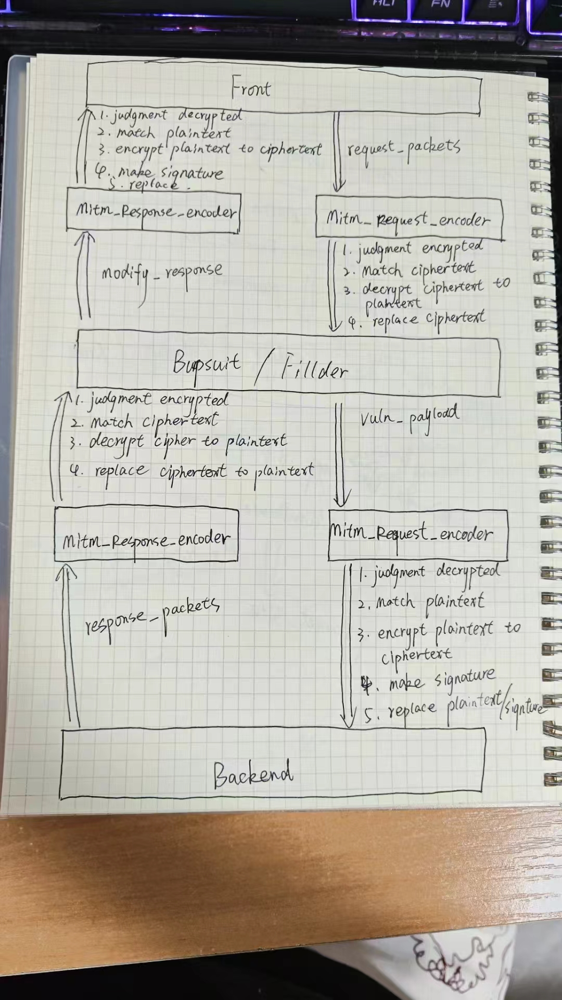
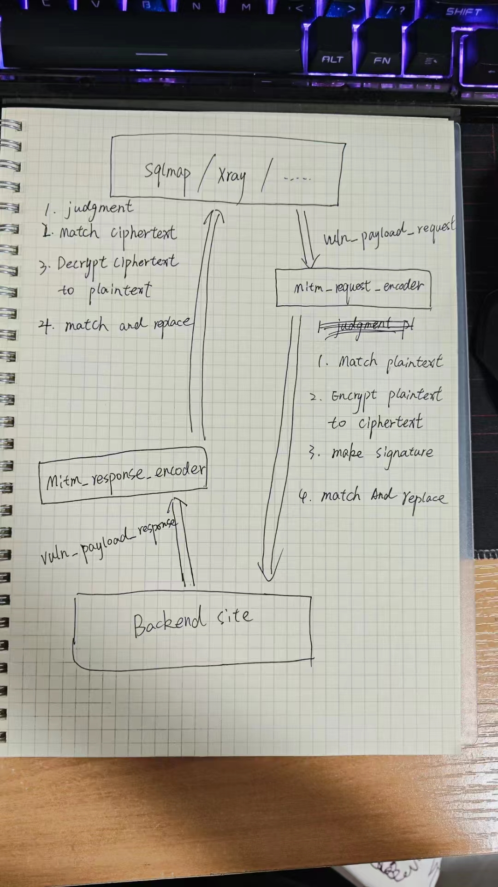

# MitmDecoder - 中间人代理加解密实践方法

## 项目简介

MitmDecoder 是一款利用 mitmproxy 的 插件脚本的，通过多层代理的方式，实现 自动进行请求/响应数据包的加解密、重新生成签名、篡改数据包唯一标识的 实践方法+插件脚本库。

Q: 为什么要把这个项目定为 实践方法 而不是 工具或者系统？

A: 主要是目前作者还没想好一个能在各个场景下，完全通用的、简单、傻瓜式的、完善的工具化方法，所以目前只好先积累几个典型的加解密场景的解决办法和脚本。等积累到量级了后再说吧~

## 安装说明

安装 mitmproxy 库即可
```commandline
python -m pip install mitmproxy -i https://pypi.tuna.tsinghua.edu.cn/simple
```

## 使用指南

### 项目的构思

项目的构思早在 2023年9月份就初步设计好了，当时画的设计手稿比较潦草，可以先大概瞅瞅

联动 BurpSuite 的设计思路



联动 漏洞扫描器的设计思路




### 脚本的使用方法

以联动 BurpSuite 为例子，需要开启 2个代理端

第一个代理端 Front2Burp

Front（前端app、web、apk） ==> Front2Burp ==> BurpSuite

将Front前端流量代理到 Front2Burp 的 8081端口，然后 Front2Burp 设置定向下游代理到 BurpSuite 的 8080 端口。使用写好的 addons_Front2Burp.py 插件脚本实现请求数据包的解密和响应数据包的加密。

```commandline
mitmdump.exe -s .\addons_Front2Burp.py --listen-port 8081  --mode upstream:http://127.0.0.1:8080 -k
```

第二个代理端 Burp2Backend

BurpSuite ==> Burp2Backend ==> Backend（后端服务器）

首先 BurpSuite 要在 Upstream proxy servers 中设置好代理，这里是代理到 Burp2Backend 的 8082 端口，使用写好的  addons_Burp2Backend.py 插件脚本实现请求数据包的加密换签和响应数据包的解密。

```commandline
mitmdump.exe -s .\addons_Burp2Backend.py --listen-port 8082 -k
```

## 特性列表

- 中间人代理方式，可以套娃到BurpSuite中，也可以作为SQLMap、Xray的上游代理，一劳永逸。
- 需要一定编程基础，后续会慢慢补充常用加解密（AES、RAS、SM4、SM2、DES）、Hash（md5、sha1、sha256、SM3）的参考案例。

## 许可证信息

MitmDecoder采用Apache License 2.0许可证

## 项目参考

https://mitmproxy.org/#mitmdump

https://github.com/mitmproxy/mitmproxy

https://ptorch.com/docs/10/mitmproxy_introduction


## 最后的话

设计 MitmDecoder 的初衷就是为了便于测试，减低门槛促进内卷（bushi），发现更多隐藏在密文背后的安全问题。

